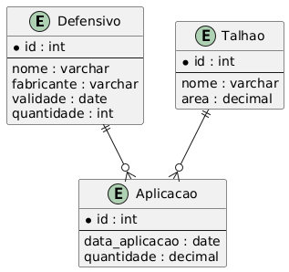
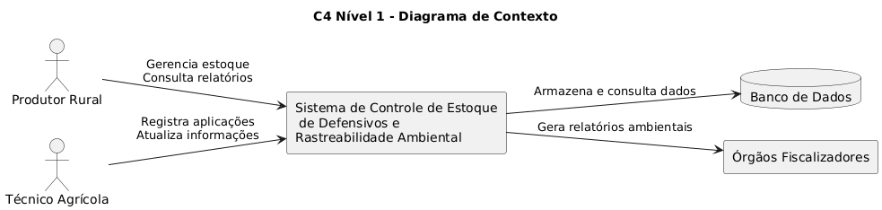
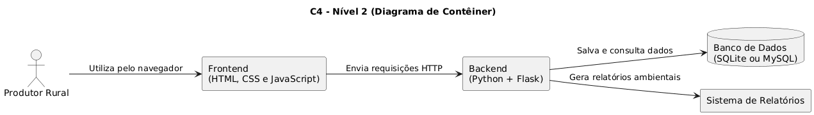
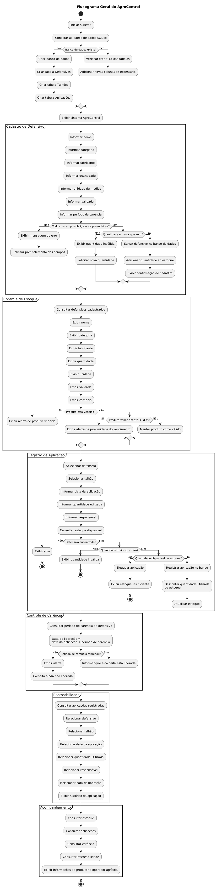

# 🌱 AgroControle: Defensivos e Rastreabilidade Ambiental

## 🌐 Aplicação Online

....

## 📖 Sobre o projeto

O AgroControl é uma aplicação web desenvolvida para auxiliar
o produtor rural no gerenciamento de defensivos agrícolas,
controle de estoque, registro de aplicações, rastreabilidade
e acompanhamento do período de carência.

## 🎯 Objetivo

Auxiliar o produtor rural no controle dos defensivos utilizados
na propriedade, reduzindo perdas e facilitando o acompanhamento
das aplicações e da liberação da colheita.

## 🌾 Funcionalidades

- Cadastro de defensivos;
- Controle de estoque;
- Registro de aplicações;
- Desconto automático do estoque;
- Rastreabilidade;
- Controle do período de carência;
- Verificação da liberação da colheita;
- Fluxograma do processo do Agro.

## 👥 Equipe

- Maria Eduarda dos S. Celho — @scmadu
- Mariana V. Schmitt — @marianavschmitt-star
- Rafaela R. S. Oliveira — @rafaelaoliveiira01-droid

## 👩‍🏫 Orientadora

Profa. Eudoxia Moura

## 🏫 Instituição

Intituto Federal de Rôndonia - Campus Ariquemes

## Arquitetura do Sistema !

### Banco de Dados

### C4 - Nível 1 (Contexto)

### C4 - Nível 2 (Contêiner)

### Fluxograma

